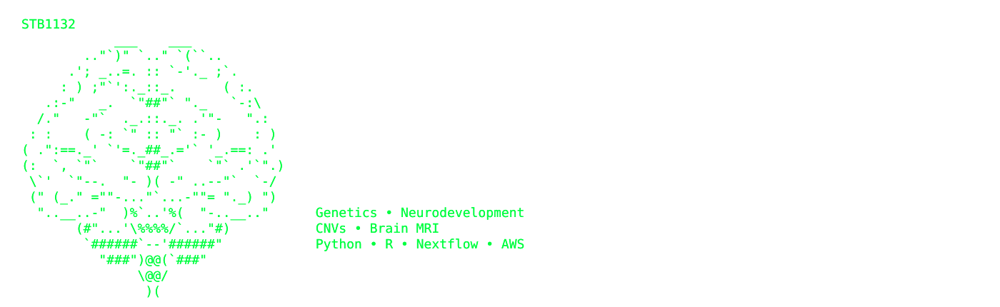
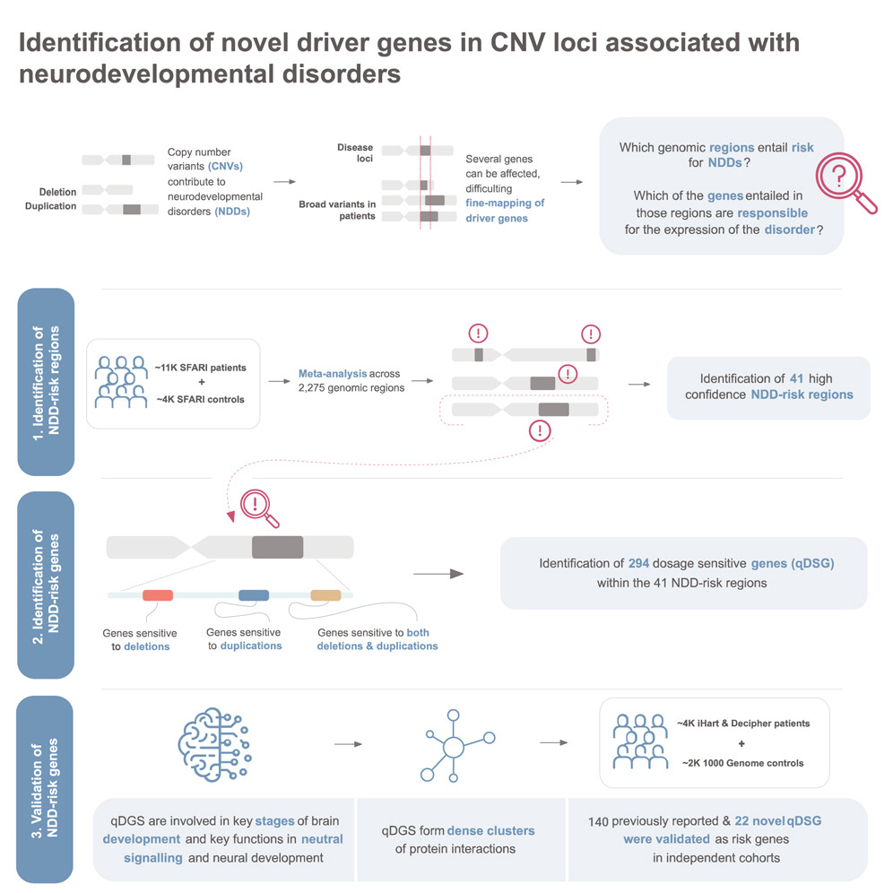

  

Computational Biologist · Industrial PhD in Genetics 
Neurodevelopmental Genomics 

---

# Selected Publications

## Identification of novel driver risk genes in CNV loci associated with neurodevelopmental disorders
*Human Genetics and Genomics Advances (2024)*

<table>
<tr>
<td width="68%" valign="top">

We analysed more than **15,000 individuals** to identify **41 neurodevelopmental disorder risk CNV loci**, including **24 previously unreported regions**, and validated **162 dosage-sensitive genes** driving neurodevelopmental risk. The results support a **polygenic model** in which multiple dosage-sensitive genes within the same CNV jointly contribute to disease susceptibility.

**Highlights**

- 41 NDD-associated CNV loci
- 24 novel loci
- 162 validated dosage-sensitive genes
- Meta-analysis across SFARI, iHART, DECIPHER and 1000 Genomes

**🔗 Publication**

https://www.cell.com/hgg-advances/fulltext/S2666-2477(24)00055-1

</td>

<td width="32%" align="center">

</td>
</tr>
</table>

---

## Assessment of Brain Morphological Abnormalities and Neurodevelopmental Risk Copy Number Variants in Individuals from the UK Biobank
*International Journal of Molecular Sciences (2025)*

Using brain MRI data from the **UK Biobank**, this study investigates how pathogenic neurodevelopmental CNVs alter cortical and subcortical morphology, providing population-scale evidence linking genomic variation with structural brain phenotypes.

**🔗 Publication**

https://www.mdpi.com/1422-0067/26/15/7062

---

## Translating Precision Medicine for Autism Spectrum Disorder: A Pressing Need
*Drug Discovery Today (2023)*

A perspective on why **precision medicine** is essential for autism therapeutics, advocating patient stratification through molecular, genetic and clinical biomarkers to improve treatment development and clinical trial success.

**🔗 Publication**

https://www.sciencedirect.com/science/article/pii/S1359644623000028
